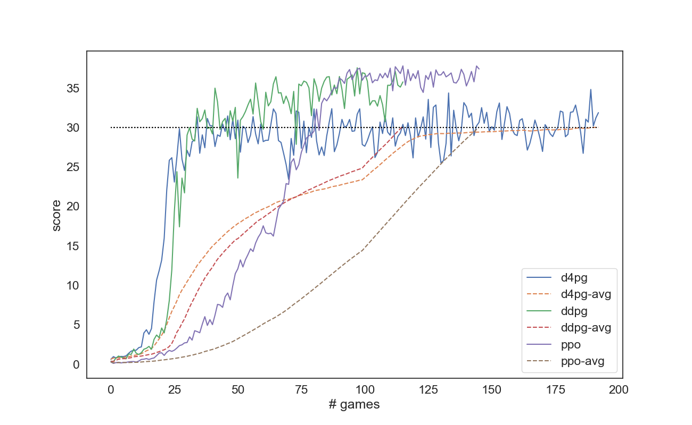

[//]: # (Image References)

[image1]: https://user-images.githubusercontent.com/10624937/43851024-320ba930-9aff-11e8-8493-ee547c6af349.gif "Trained Agent"

# Project 2: Continuous Control

![Trained Agent][image1]

This repository contains material related to Udacity's Deep Reinforcement Learning course.

### Project Details

In this environment, 20 agents each consisting of a double-jointed arm can move to target locations (denoted by the green sphere). A reward of +0.1 is provided for each step that the agent's hand is in the goal location. Thus, the goal of your agent is to maintain its position at the target location for as many time steps as possible.

The state space consists of 33 variables corresponding to position, rotation, velocity, and angular velocities of the arm. 

Each action is a vector with four numbers, corresponding to torque applicable to two joints. Joints move in an continuous vector space along the x/z axis. Every entry in the action vector is a float between -1 and 1.

This episodic task is considered solved when the average reward of the 20 agents is +30 for at least 100 episodes.

### Credit

Credit goes to https://github.com/telmo-correa/DRLND-project-2 adapting code to implement the PPO network. 
Credit also goes to https://github.com/wpumacay/DeeprlND-projects for adapting code to implement the priority replay buffer.
Credit to # https://github.com/PacktPublishing/Deep-Reinforcement-Learning-Hands-On/blob/master/ for implementing the distribution portion of the code in D4PG.

### Getting Started

1. Download the environment from the link below.  You need only select the environment that matches your operating system:

    - **_Version 2: Twenty (20) Agents_**
        - Linux: [click here](https://s3-us-west-1.amazonaws.com/udacity-drlnd/P2/Reacher/Reacher_Linux.zip)
        - Mac OSX: [click here](https://s3-us-west-1.amazonaws.com/udacity-drlnd/P2/Reacher/Reacher.app.zip)
        - Windows (32-bit): [click here](https://s3-us-west-1.amazonaws.com/udacity-drlnd/P2/Reacher/Reacher_Windows_x86.zip)
        - Windows (64-bit): [click here](https://s3-us-west-1.amazonaws.com/udacity-drlnd/P2/Reacher/Reacher_Windows_x86_64.zip)
    
    (_For Windows users_) Check out [this link](https://support.microsoft.com/en-us/help/827218/how-to-determine-whether-a-computer-is-running-a-32-bit-version-or-64) if you need help with determining if your computer is running a 32-bit version or 64-bit version of the Windows operating system.

    (_For AWS_) If you'd like to train the agent on AWS (and have not [enabled a virtual screen](https://github.com/Unity-Technologies/ml-agents/blob/master/docs/Training-on-Amazon-Web-Service.md)), then please use [this link](https://s3-us-west-1.amazonaws.com/udacity-drlnd/P2/Reacher/one_agent/Reacher_Linux_NoVis.zip) (version 1) or [this link](https://s3-us-west-1.amazonaws.com/udacity-drlnd/P2/Reacher/Reacher_Linux_NoVis.zip) (version 2) to obtain the "headless" version of the environment.  You will **not** be able to watch the agent without enabling a virtual screen, but you will be able to train the agent.  (_To watch the agent, you should follow the instructions to [enable a virtual screen](https://github.com/Unity-Technologies/ml-agents/blob/master/docs/Training-on-Amazon-Web-Service.md), and then download the environment for the **Linux** operating system above._)

2. Place the file in the root of the repository and unzip (or decompress) the file. Then, install several dependencies.
```bash
git clone https://github.com/gktval/Continuous_Control
cd python
pip install .
```

3. Navigate to the `python/` folder. Run the file `main.py` found in the `python/` folder.

### Instructions

Running the code without any changes will start a unity session and train the DDPG agent. Alternatively, you can change the agent model in the run method. The following agents are available as options:

    DDPG
    D4PG
    PPO

In the initialization method of main.py, you can change the type of network to run. This will take you to the 'Run' method in the ddpg, d4pg, and ppo files. In the 'Run' method, you can change the configuration and parameters for each of the networks. In the config file, you can also find addition parameters for each o#gef the networks. 

The scores of the training will be stored in a folder called `scores`. Saved agents will be stored in a folder called `checkpoints`. After running several of the networks, you can replay the trained agent by changing the `isTest` variable from the initialization in main.py

### Report
This graph shows the scores of the various trained continuous control agents used in this project. 
The results of the training will be stored in a folder called scores location in the python folder. After running several of the deep neural networks, you can replay the trained agent by changing the isTest variable passed into the run() method.

Each of the algorithms described above achieved an average score of +30 over 100 episodes as listed below: DDPG - 116 episodes D4PG - 193 episodes PPO - 146 episodes

The PPO algorithm achieved the results in more episodes than DDPG, but the process complete more quickly. Once PPO reach a score of +30, the distribution of rewards was much more compact than DDPG. The D4PG achieved a score of 30 the same number of episodes (35), but it took the D4PG algorithm much longer to reach the average score of 30 over 100 episodes because it plateaued and did not achieve as high of scores as DDPG or PPO.

"Scores of trained agents and rolling averages"
